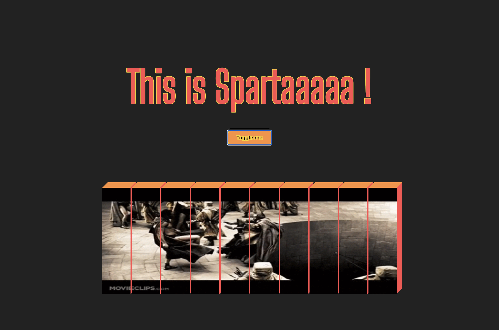

# Sparta

This is basic JavaScript educational project.
  
Sparta let user play with animated GIF from solid picture to shattered vertical bars stil displaying GIF but with graphic impression of 3D blocks.

`Specific use depending on web purpose, definitely not for all designs.`
  

   

### Future developement ideas:

- extending time applying different animation movements to particular pieces of picture
- introduce loop and interactive responce for mouseover / click, more like long playing banner
    

### Credits:

- inspiration based on Brad Traversy's [tutorial](https://github.com/bradtraversy/50projects50days/tree/master/3d-boxes-background)
- GIF credits: https://giphy.com/

 
brulionman 05/21
